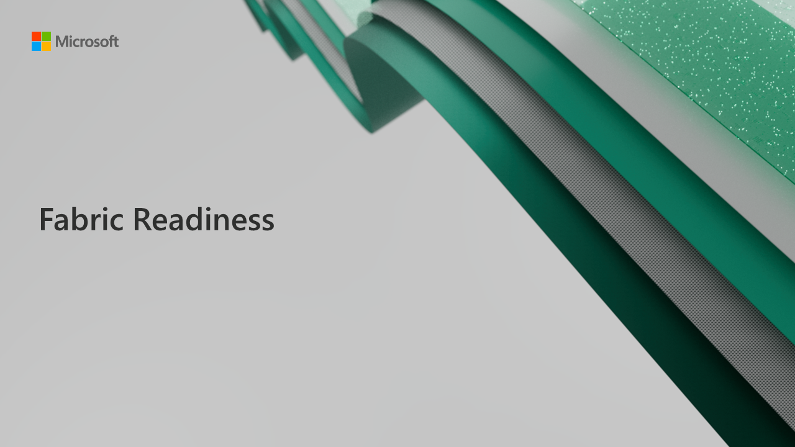

# Fabric Readiness



The Fabric Readiness repo is designed to enable communities interested in topics and concepts related to [Microsoft Fabric](https://www.microsoft.com/en/microsoft-fabric/). This repository currently provides a collection of presentation decks that are intended to be reused in user groups, online presentations, in-person conferences, and customer conversations. All presentation slides contain fully transcribed notes, allowing presenters to confidently deliver accurate messaging of the covered topics. These decks may be modified, revised, and used for any purpose that you see fitting.   

To pull down a local copy of all included slide decks with git tracking, ensure that you have installed and enabled [git-lfs](https://git-lfs.com/), then clone this repo with:

```
git clone https://github.com/microsoft/Fabric-Readiness.git
```

# Presentation Content & Abstracts

These presentations were created to support the [Fabric Webinar Series](https://aka.ms/fabric-webinar-series) that was created to support the [Public Preview announcment Microsoft Fabric at Build 2023](https://azure.microsoft.com/blog/introducing-microsoft-fabric-data-analytics-for-the-era-of-ai/).  You can view recordings of these presentations being delivered at https://aka.ms/fabric-webinar-series.

| Title                                                   | Description                                                                                                                                                                                            | Slides                                                                                                         | View Slides Online                                                                                                                                                                                                    |
| ------------------------------------------------------- | ------------------------------------------------------------------------------------------------------------------------------------------------------------------------------------------------------ | -------------------------------------------------------------------------------------------------------------- | --------------------------------------------------------------------------------------------------------------------------------------------------------------------------------------------------------------------- |
| 01. Introducing Unified Analytics                       | Microsoft Fabric delivers an integrated and simplified experience for all analytics workloads and users on an enterprise-grade data foundation.                                                        | [Download .pptx](./presentations/01.%20Introducing%20Unified%20Analytics.pptx)                                 | [Preview Online](https://view.officeapps.live.com/op/view.aspx?src=https://github.com/microsoft/Fabric-Readiness/raw/main/presentations/01.%20Introducing%20Unified%20Analytics.pptx)                                 |
| 02. Data Engineering with Microsoft Synapse             | Discover how you can simplify data engineering with the tools you already know—like Synapse—in Microsoft Fabric.                                                                                       | [Download .pptx](./presentations/02.%20Data%20Engineering%20with%20Microsoft%20Synapse.pptx)                   | [Preview Online](https://view.officeapps.live.com/op/view.aspx?src=https://github.com/microsoft/Fabric-Readiness/raw/main/presentations/02.%20Data%20Engineering%20with%20Microsoft%20Synapse.pptx)                   |
| 03. Data Science in Microsoft Fabric                    | Learn about Fabric's Data Science capabilities. Prepare your data and run machine learning workflows at scale.                                                                                         | [Download .pptx](./presentations/03.%20Data%20Science%20in%20Microsoft%20Fabric.pptx)                          | [Preview Online](https://view.officeapps.live.com/op/view.aspx?src=https://github.com/microsoft/Fabric-Readiness/raw/main/presentations/03.%20Data%20Science%20in%20Microsoft%20Fabric.pptx)                          |
| 04. Data Warehousing with Microsoft Fabric              | Learn how to build a data warehouse on top of OneLake, unify datasets, and connect to machine learning, analysis, and visualization tools—helping unlock intelligent decision-making.                  | [Download .pptx](./presentations/04.%20Data%20Warehousing%20with%20Microsoft%20Fabric.pptx)                    | [Preview Online](https://view.officeapps.live.com/op/view.aspx?src=https://github.com/microsoft/Fabric-Readiness/raw/main/presentations/04.%20Data%20Warehousing%20with%20Microsoft%20Fabric.pptx)                    |
| 05. Synapse Real-Time Analytics in Microsoft Fabric     | Use Microsoft Fabric Real-Time Analytics to ingest data from multiple sources, uncovering insights that help you improve products, enhance customer experiences, monitor devices, and boost operations | [Download .pptx](./presentations/05.%20Synapse%20Real-Time%20Analytics%20in%20Microsoft%20Fabric.pptx)         | [Preview Online](https://view.officeapps.live.com/op/view.aspx?src=https://github.com/microsoft/Fabric-Readiness/raw/main/presentations/05.%20Synapse%20Real-Time%20Analytics%20in%20Microsoft%20Fabric.pptx)         |
| 06. Data Integration with Data Factory                  | Learn how to orchestrate data movement and data transformation to efficiently monitor and manage data across your organization at enterprise scale with Microsoft Fabric.                              | [Download .pptx](./presentations/06.%20Data%20Integration%20with%20Data%20Factory.pptx)                        | [Preview Online](https://view.officeapps.live.com/op/view.aspx?src=https://github.com/microsoft/Fabric-Readiness/raw/main/presentations/06.%20Data%20Integration%20with%20Data%20Factory.pptx)                        |
| 07. Introduction to Microsoft Fabric for Power BI Users | Easily connect data sources and create reports with cutting-edge visualizations to unlock insights for your organization. See how building reports is now more simple, productive, and effective.      | [Download .pptx](./presentations/07.%20Introduction%20to%20Microsoft%20Fabric%20for%20Power%20BI%20Users.pptx) | [Preview Online](https://view.officeapps.live.com/op/view.aspx?src=https://github.com/microsoft/Fabric-Readiness/raw/main/presentations/07.%20Introduction%20to%20Microsoft%20Fabric%20for%20Power%20BI%20Users.pptx) |

# Contributing

This project welcomes contributions and suggestions. Most contributions require you to agree to a
Contributor License Agreement (CLA) declaring that you have the right to, and actually do, grant us
the rights to use your contribution. For details, visit https://cla.opensource.microsoft.com.

When you submit a pull request, a CLA bot will automatically determine whether you need to provide
a CLA and decorate the PR appropriately (e.g., status check, comment). Simply follow the instructions
provided by the bot. You will only need to do this once across all repos using our CLA.

This project has adopted the [Microsoft Open Source Code of Conduct](https://opensource.microsoft.com/codeofconduct/).
For more information see the [Code of Conduct FAQ](https://opensource.microsoft.com/codeofconduct/faq/) or
contact [opencode@microsoft.com](mailto:opencode@microsoft.com) with any additional questions or comments.

# Legal Notices

Microsoft and any contributors grant you a license to the Microsoft documentation and other content
in this repository under the [Creative Commons Attribution 4.0 International Public License](https://creativecommons.org/licenses/by/4.0/legalcode),
see the [LICENSE](LICENSE) file, and grant you a license to any code in the repository under the [MIT License](https://opensource.org/licenses/MIT), see the
[LICENSE-CODE](LICENSE-CODE) file.

Microsoft, Windows, Microsoft Azure and/or other Microsoft products and services referenced in the documentation
may be either trademarks or registered trademarks of Microsoft in the United States and/or other countries.
The licenses for this project do not grant you rights to use any Microsoft names, logos, or trademarks.
Microsoft's general trademark guidelines can be found at http://go.microsoft.com/fwlink/?LinkID=254653.

Privacy information can be found at https://privacy.microsoft.com/en-us/

Microsoft and any contributors reserve all other rights, whether under their respective copyrights, patents,
or trademarks, whether by implication, estoppel or otherwise.
