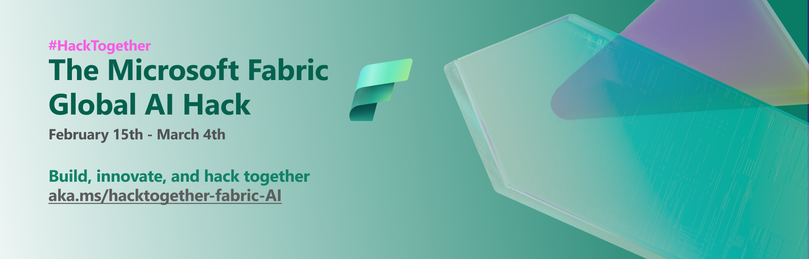

# Thank You for attending a "Hack Together: The Microsoft Fabric Global AI Hack" Livestream!

We're delighted you joined us for a recent "Hack Together: The Microsoft Fabric Global AI Hack" livestream session. Below, you'll find a treasure trove of resources to further your learning and engagement with Microsoft Fabric.

## Dive Deeper into Microsoft Fabric

### Join us for the first ever Fabric Community conference

On March 26-28, 2024 in Las Vegas:

- 🔍 Some MAJOR announcements, new features, and cool demos are in store. And no it won't be recorded, so you'll need to be there to see it!
- 🎒 Hands on training with Power BI, Synapse, Data Factory, and Azure Databases from the world's best. Dedicated time to get into all things Microsoft Fabric. 
- ✨ Learn how to get your existing data solutions ready for AI, build your own LLMs, and become more productive with Microsoft Copilot.
- 😻 Hang with the product team, Microsoft MVPs, customers, and likeminded data lovers from the hashtag#MicrosoftFabric and hashtag#PowerBI communities. 

[Save your seat now](https://blog.fabric.microsoft.com/en-us/blog/save-your-seat-at-the-ultimate-fabric-learning-event?ft=All) and use code MSCUST for a $100 discount!

### 👩‍💻 Microsoft Fabric Career Hub

The one-stop location to begin your learning journey for the [DP-600: Implementing Analytics Solutions Using Microsoft Fabric certification](https://learn.microsoft.com/en-us/credentials/certifications/exams/dp-600/).

[Microsoft Fabric Career Hub on the Fabric Community Site](https://aka.ms/FabricCareerHub?ocid=fabric24_careerhub_blog_cxa)

> 🎓 **Special Offer:** Secure a **50% discount voucher for the Microsoft Fabric Exam** by completing the [Microsoft Fabric Cloud Skills Challenge](https://aka.ms/fabric30dtli) between January and June 2024.

### 🌟 Microsoft Fabric Learn Together

Join us for expert-guided live sessions! These will cover all necessary modules to ace the DP-600 exam and achieve the Fabric Analytics Engineer Associate certification. Offering 9 episodes, catered to both India and Americas time zones.

[Explore Learn Together Sessions](https://learn.microsoft.com/shows/learn-live/microsoft-fabric-wave-1/)

### 📖 Hands-On Learning with Fabric

Enhance your skills with over 30 interactive, on-demand learning modules tailored for Microsoft Fabric.

[Start Your Learning Journey](https://learn.microsoft.com/training/browse/?products=fabric)

### ☁️ Microsoft AI Tour Cloud Skills Challenge

Microsoft Learn helps you discover the tools and enhance your skills as an AI engineer, Data Analyst, Data Engineer, Data Scientist, and Developer. Develop your skills with five AI-themed challenges. Complete a challenge within 30 days of starting for a chance to earn a 50% discount on a Microsoft Certification exam.

[Start Your Learning Journey](https://learn.microsoft.com/en-us/collections/kxqae021m5j5m?wt.mc_id=aitour_advocacydeck_devcollection_cnl)

### 🛠️ Hack Together: The Microsoft Fabric Global AI Hack

The Microsoft Fabric Global AI Hack is your playground for creating and experimenting with Microsoft Fabric. With mentorship from Microsoft experts and access to the latest tech, you will learn how to build AI solutions with Microsoft Fabric! The possibilities are endless for what you can create... plus you can submit your hack for a chance to win exciting prizes! 🥳

[Join the Microsoft Fabric Global AI Hackthon](https://aka.ms/fabricaihack)

### 🟩 Easy Learning with [Fabric Notes](https://aka.ms/fabricnotes)

Unlock the power of Microsoft Fabric with engaging, easy-to-understand illustrations. Perfect for all levels of expertise!

[Access Fabric Notes Here](https://aka.ms/fabricnotes)

## 🗺️ Your Path to Microsoft Fabric Certification

_Currently, the Fabric Certification is under development._

Get ready for [DP-600: Implementing Analytics Solutions Using Microsoft Fabric](https://learn.microsoft.com/credentials/certifications/exams/dp-600/). Start preparing today to become a certified Microsoft Fabric practitioner.

## 💬 Join the Microsoft Fabric Community

Connect with fellow Fabric enthusiasts and experts. Your one-stop community hub: https://community.fabric.microsoft.com/. Here's what you'll find:

- Interactive forums, like the [Synapse Forum](https://community.fabric.microsoft.com/t5/Synapse-forums/ct-p/AC-Community).
- A global directory of [Fabric User Groups](https://community.fabric.microsoft.com/t5/Fabric-User-Groups/ct-p/fbc_usergroups).
- The [Ideas Platform](https://ideas.fabric.microsoft.com/) for sharing and voting on product feedback.
- Stay updated with the [Official Updates Blog](https://blog.fabric.microsoft.com/blog/).

## ⏭️ Stay Ahead: The Future of Microsoft Fabric

Be in the know with the latest developments and upcoming features. Check out the public roadmap at https://aka.ms/FabricRoadmap
