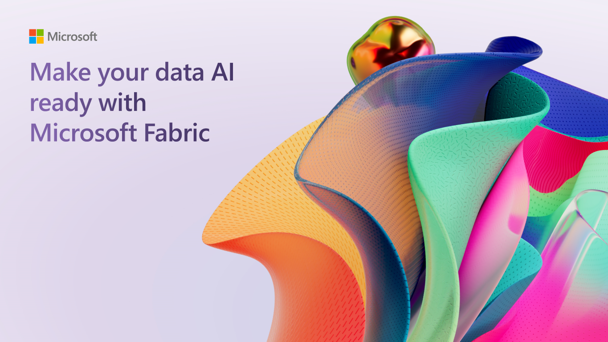
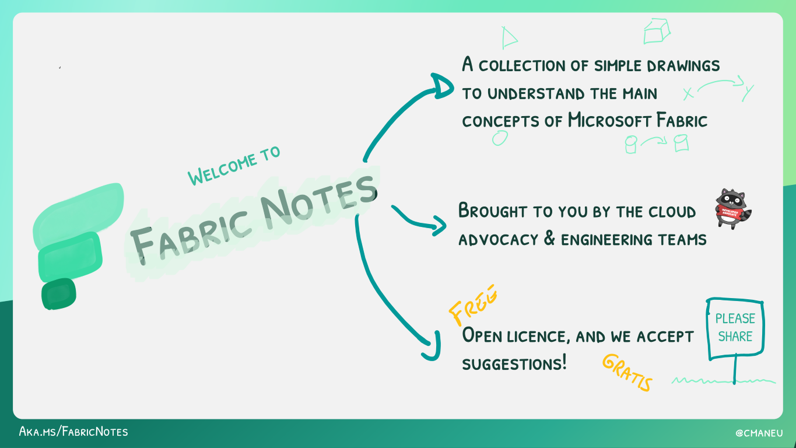

# Thank You for Attending the Microsoft AI Tour!

We're delighted you joined us for the "Make your data AI ready with Microsoft Fabric" session. Below, you'll find a treasure trove of resources to further your learning and engagement with Microsoft Fabric.

## Dive Deeper into Microsoft Fabric

### 🌟 Microsoft Fabric Learn Together

Join us for expert-guided live sessions! These will cover all necessary modules to ace the DP-600 exam and achieve the Fabric Analytics Engineer Associate certification. Offering 9 episodes, catered to both India and Americas time zones.

[Explore Learn Together Sessions](https://learn.microsoft.com/shows/learn-live/microsoft-fabric-wave-1/)

### 👩‍💻 Hands-On Learning with Fabric

Enhance your skills with over 30 interactive, on-demand learning modules tailored for Microsoft Fabric.

[Start Your Learning Journey](https://learn.microsoft.com/training/browse/?products=fabric)

> 🎓 **Special Offer:** Secure a **50% discount voucher for the Microsoft Fabric Exam** by completing the [Cloud Skills Challenge](https://aka.ms/fabric30dtli) between January and June 2024.

### 🛠️ Hack Together: The Microsoft Fabric Global AI Hack

The Microsoft Fabric Global AI Hack is your playground for creating and experimenting with Microsoft Fabric. With mentorship from Microsoft experts and access to the latest tech, you will learn how to build AI solutions with Microsoft Fabric! The possibilities are endless for what you can create... plus you can submit your hack for a chance to win exciting prizes! 🥳

[Join the Microsoft Fabric Global AI Hackthon](https://aka.ms/fabricaihack)

### 🟩 Easy Learning with [Fabric Notes](https://aka.ms/fabricnotes)

Unlock the power of Microsoft Fabric with engaging, easy-to-understand illustrations. Perfect for all levels of expertise!

[Access Fabric Notes Here](https://aka.ms/fabricnotes)

## 🗺️ Your Path to Microsoft Fabric Certification

_Currently, the Fabric Certification is under development._

Get ready for [DP-600: Implementing Analytics Solutions Using Microsoft Fabric](https://learn.microsoft.com/credentials/certifications/exams/dp-600/). Start preparing today to become a certified Microsoft Fabric practitioner.

## Join us at the first ever Microsoft Fabric Community Conference

Join us at the first annual Microsoft Fabric Community Conference and see firsthand how Microsoft Fabric and the rest of the data and AI products at Microsoft can help your organization prepare for the era of AI. You’ll hear from leading Microsoft and community experts from around the world and get hands on experiences with the latest features from Microsoft Fabric, Power BI, Databases, Azure AI, Microsoft Purview, and more.

👉 [https://msdataaiconf.com/](https://msdataaiconf.com/#!/)

## 💬 Join the Microsoft Fabric Community

Connect with fellow Fabric enthusiasts and experts. Your one-stop community hub: https://community.fabric.microsoft.com/. Here's what you'll find:

- Interactive forums, like the [Synapse Forum](https://community.fabric.microsoft.com/t5/Synapse-forums/ct-p/AC-Community).
- A global directory of [Fabric User Groups](https://community.fabric.microsoft.com/t5/Fabric-User-Groups/ct-p/fbc_usergroups).
- The [Ideas Platform](https://ideas.fabric.microsoft.com/) for sharing and voting on product feedback.
- Stay updated with the [Official Updates Blog](https://blog.fabric.microsoft.com/blog/).

## ⏭️ Stay Ahead: The Future of Microsoft Fabric

Be in the know with the latest developments and upcoming features. Check out the public roadmap at https://aka.ms/FabricRoadmap
